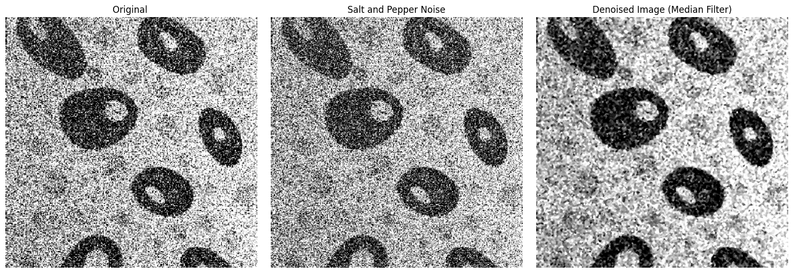
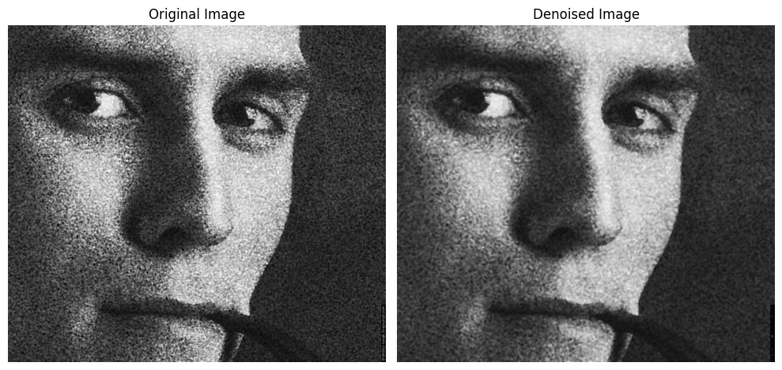
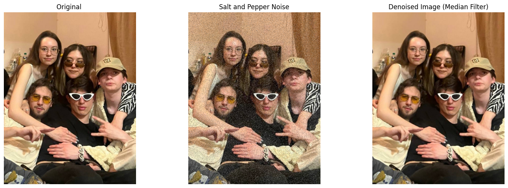
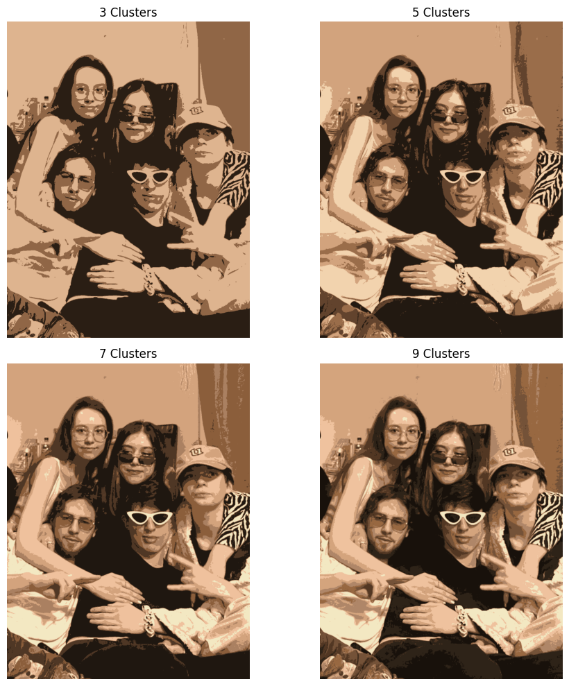

# Базовые методы компьютерного зрения

Эксперименты в Jupyter по базовым приёмам CV: добавление шума, фильтрация (шумоподавление), кластеризация (сегментация) и сопоставление шаблонов.

## Что сделано

1. **Шум “Salt & Pepper” -> медианный фильтр**

    - Добавляем импульсный шум, восстанавливаем изображение медианным фильтром.
    - Сравнение до/после на синтетике и реальных фото.
      

        
      

    

      
    

2. **Кластеризация (K-Means) как простая сегментация**

    - Перекодируем пиксели в признаки, применяем `cv2.kmeans`.
    - Смотрим влияние числа кластеров (3/5/7/9).
      

        
      

3. **Template Matching + усиление границ**
    - Находим шаблон на сцене через `cv2.matchTemplate`.
    - Усиливаем контуры (Sobel/Canny) для наглядности.
      

        
      

